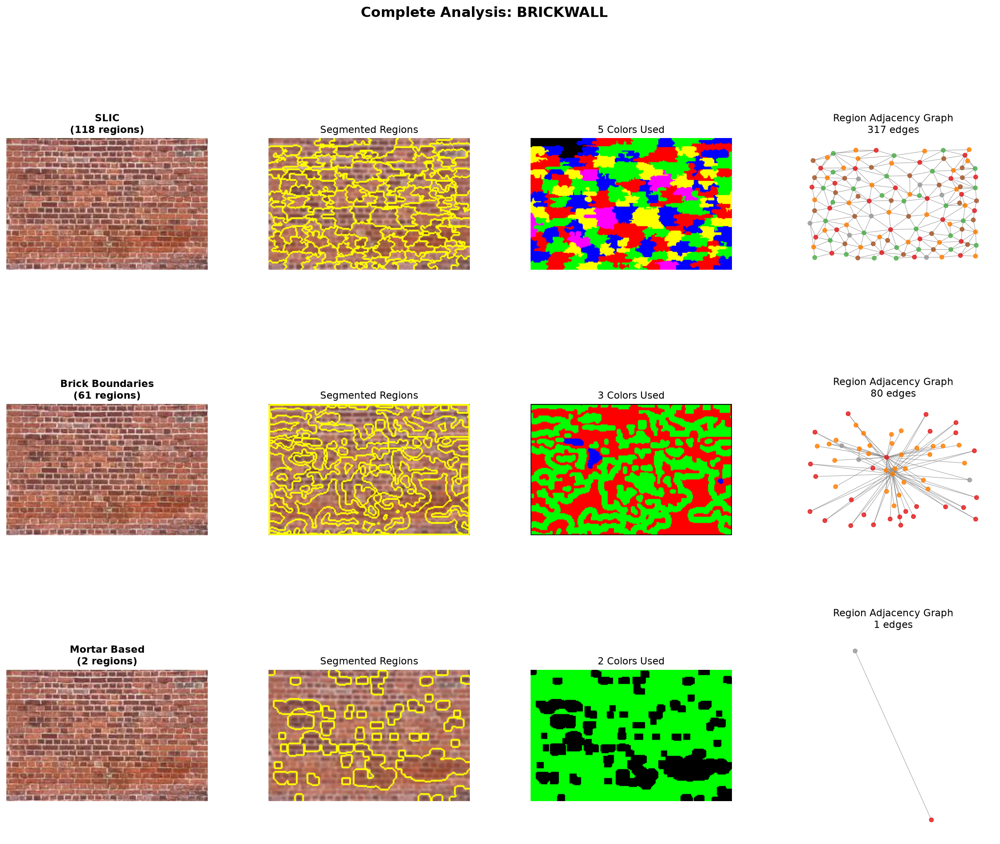

# ImageProcIdea — Image Segmentation as a Graph Coloring Problem

Treats image segmentation as a graph coloring problem: segment an image into regions, build a
graph where each region is a node and touching regions are edges, then color that graph so no two
adjacent regions share a color — the classic map-coloring problem (Four Color Theorem), applied to
real images.

```
image ──▶ segment into regions ──▶ Region Adjacency Graph ──▶ graph coloring ──▶ colored output
```

It's a general-purpose way to turn "what are the distinct regions/patterns in this image, and how
do they relate spatially?" into a graph problem — not tied to any one image type. Textures (brick,
wood grain) are the test cases here because they're a good stress test for segmentation (subtle,
irregular boundaries), but the same pipeline applies to any image where you want to find and relate
regions: texture/material analysis, pattern discovery, or region-based robot path planning (e.g. a
painting robot treating each color as a separate pass). See
[`Guide/PROJECT_IDEA.md`](Guide/PROJECT_IDEA.md) for the fuller motivation and application ideas.

## How it works

1. **Load & preprocess** — resize/denoise (`cv2`)
2. **Segment** — four interchangeable methods: SLIC superpixels, watershed, edge-based, or
   texture-specific brick-boundary / mortar-line detection
3. **Build a Region Adjacency Graph** — each region → node, shared borders → edges (`networkx`)
4. **Color the graph** — greedy coloring, minimizing colors so no adjacent regions match
5. **Visualize** — original image, segmentation boundaries, colored result, and the graph itself,
   side by side, for every method

See [`Guide/IMPLEMENTATION_STEPS.md`](Guide/IMPLEMENTATION_STEPS.md) for the detailed walkthrough of each step.

## Sample output

Running all three segmentation methods against a brick wall image:



This is a real, un-cherry-picked run — note the "Mortar Based" method degenerating to 2 regions on
this image. Segmentation robustness across methods/textures is an open problem the project is
still working through (see the "Technical Challenges" section in
[`Guide/PROJECT_IDEA.md`](Guide/PROJECT_IDEA.md)), not something hidden.

## Repository layout

| Path | What it is |
|---|---|
| [`Code/segment_and_color.py`](Code/segment_and_color.py) | The whole pipeline: `ImageSegmentColorizer` class (segmentation methods, RAG construction, graph coloring) plus `comprehensive_visualization()` |
| [`Guide/`](Guide) | Design docs — project motivation/applications, implementation walkthrough, segmentation method reference |
| [`input_images/`](input_images) | Sample textures to segment (brick walls, wood planks, a sky photo) |
| [`results/`](results) | Generated comparison visualizations per input image |

## Setup

Requires Python 3.10+.

```bash
python -m venv .venv
.venv\Scripts\activate        # Windows
# source .venv/bin/activate   # macOS/Linux

pip install -r requirements.txt
```

## Running it

```bash
cd Code
python segment_and_color.py ../input_images/brickwall.png
```

Saves a comparison figure to `results/brickwall_complete.png` (as shown above). Omit the argument
to run against the default sample (`input_images/brickwall.png`).

Note: larger images (the sky photo and the plain `woodplank.png` sample are several megapixels)
take noticeably longer — the brick-boundary/mortar-based methods aren't optimized for large inputs.
Resize first if you want a quick look on a big image.

Verified working end-to-end with `opencv-python==5.0.0.93`, `scikit-image==0.26.0`,
`networkx==3.6.1`, `numpy==2.5.1`, `matplotlib==3.11.0` (pinned in `requirements.txt`).

## Docs

- [`Guide/PROJECT_IDEA.md`](Guide/PROJECT_IDEA.md) — motivation, applications, technical challenges
- [`Guide/IMPLEMENTATION_STEPS.md`](Guide/IMPLEMENTATION_STEPS.md) — segmentation → RAG → coloring, step by step
- [`Guide/Segmentation.md`](Guide/Segmentation.md), [`Guide/Standard_Segmentation_Methods.md`](Guide/Standard_Segmentation_Methods.md) — segmentation method reference

## License

No license is currently granted — all rights reserved. Shared here for review/portfolio purposes.
